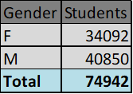
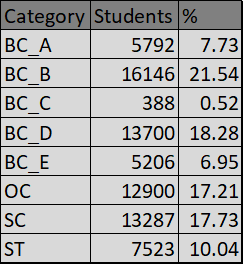
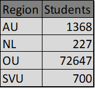
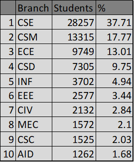
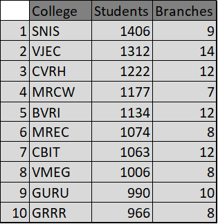
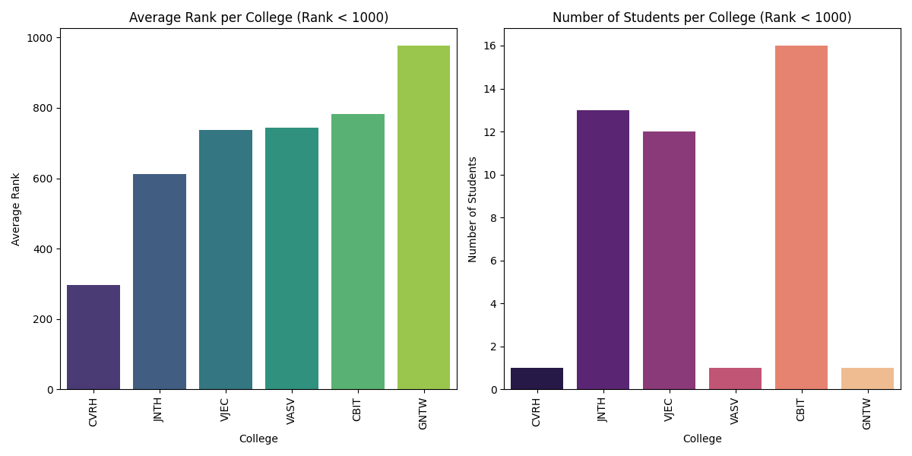
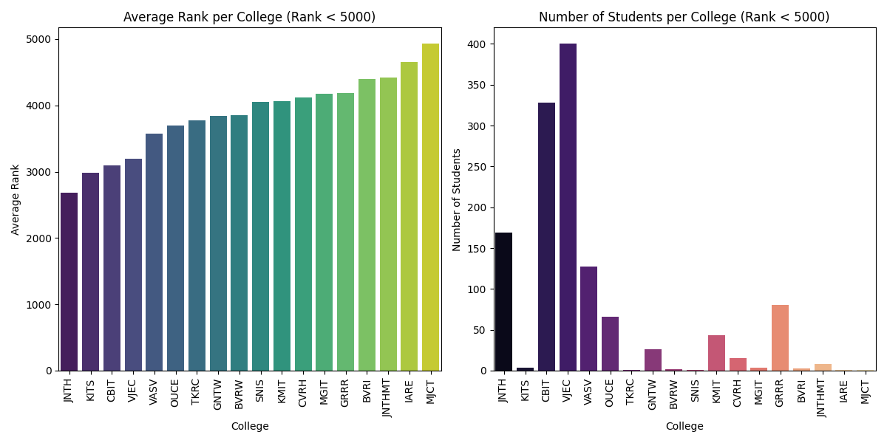
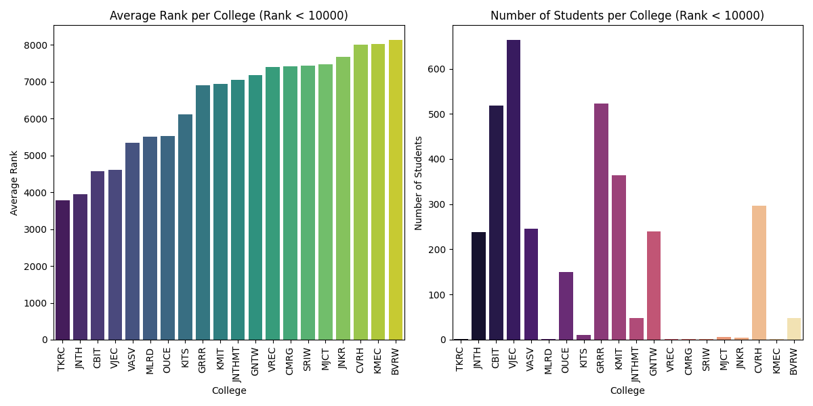
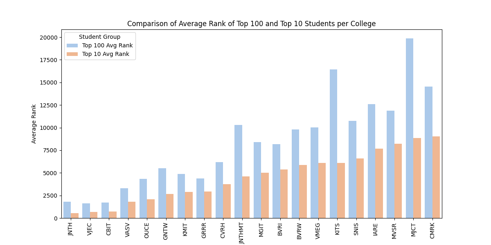

# TS EAMCET Student Analysis

This repo provides an analysis of allotted students, focusing on colleges, ranks, and student distribution. 
[Data](colleges.xlsx) scraped from official website. 
## Basic
(Done with Excel PivotTable)

#### Gender Ratio

#### Category Distribution

#### Regional Distribution

#### Branch-wise Distribution
CSE and CS-related courses take upto 70% of all students.

#### Colleges with most students 
Also shown are the number branches that they offer.

## Advanced
(Done with python)

### Average Rank per college
Few colleges may have suprising average ranks due to only 1-2 people taking the college in the specific range. View the right graphs to adjust for skewness.

##### Ranks < 1000

##### Ranks < 5000

##### Ranks < 10000

### Average Rank of Top 10 students per college
